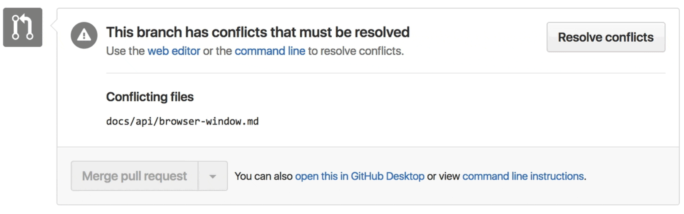

## A path to professionalism

What I appreciated the most about taking this class was that it opened my eyes to what a future career in software development could look like, so I could know what to expect and what should be expected of me. Compared to the other ICS classes I have taken so far, Software Engineering was my first introduction to professional development. Previous classes taught me the syntax of programming and how to use that to create projects and do the homework, but it always felt "removed". On the other hand, Software Engineering both expanded on what I had previously learned, and it showed me all the different tools I should know how to use if I want my work to be appealing. At the very beginning of the semester I was told I needed to create a professional profile online on TechHui and LinkedIn. Before that I did not have much in the way of a professional portfolio as it just was not one of my priorities at the time, but I am glad this class necessitated that I do have one because I now realize how valuable they are. In a similar manner, this class introduced me to JetBrain's IntelliJ IDEA. Prior to this, I had mostly stuck with editors like Visual Studio Code or Notepad++, and my most advanced experience with IDEs was Eclipse. IntelliJ was a completely different beast altogether, granted it can feel a bit bloated at times, but it allowed me to do so much more. 

The two concepts that I feel were most important to take from this class were: 
1. Open Source Software Development
2. Agile Project Management

## Merge conflicts everywhere

*Why can't you just work the first time?*

We were told of the importance of open source software development early on as it was one of the first modules. If you did not have a Github account yet then you needed to make one right away! Even before this class I was a firm [believer in open source](https://rainllo.github.io/essays/excited-for-open-source.html). Although, except for the weeks when we had to work on the final project, most Github usage was limited to working on our Techfolios and to push commits for the WODs and homeworks so they could be graded. Still, those final weeks were the most interesting and perhaps most frustrating part of working with Github. Git is a version control system that tracks changes to allow for coordinating work when multiple people are working on a project. Unfortunately, no matter how hard you try to avoid it you will eventually run into merge conflict issues due to competing changes. And as someone who was still getting the hang of git I ran into them a lot. Thankfully, Github Desktop provides a way to easily show where conflicting lines of code are located so you could fix them. It is important to become familiar with working in an open source environment and how to fix issues because you will be working with many more people committing to the code for a program in the future. Thus, even greater chances of conflicts. 

## Work together

The agile project management was another very important module, especially for reasons that expand on the previously discussed open source software module. The COVID pandemic and online classes definitely changed how we would need to plan our team coordination for the final project. As we could not meet in person, all communication within our team needed to be done through Discord. Thankfully, this did not prove to be too much of a problem. I am so grateful to have worked with the people on my team, they contributed a whole lot to the effort and together we were able to deliver a great final project. This is just a taste of a future where I may need to work with tens and even hundreds of people. 

