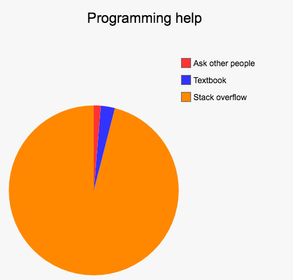

## No one knows how stupid or smart you are online, usually

We've all experienced, actually, we always seem to be experiencing it. After explaining a topic, the professor will always ask the students for questions to see if there are some of those having trouble understading the material. And unfortunately for the professor, the students often respond with crickets. Many students don't like to ask questions and I know I'm one of those. I understand it's detrimental to my learning to not ask questions that I have, but the thing is that I don't want to ask questions *in front of the class*. It makes me anxious, I don't like having the spotlight on me. A art of myself also thinks that if I'm asking a question and no one else is, is because everyone understands it but me and that makes me feel bad. If I do have a question that still needs answering I prefer to ask it in person and not in front of everyone. However, the Internet is different. Unless you make your username your real name or set your profile picture to a selfie of yourself, chances are that no one online will know it's you. There's no real fear about making yourself look dumb online because no one knows it's you, so ask away! But the thing is that online, no one wants to help you if you ask stupid questions. One needs to format their questions in a smart manner to receive help. That way your question won't be passed off as simply a duplicate of another question posted by a user years ago, as Stack Overflow is notriously known for. 

## I lost the file I deleted!

The site [How To Ask Questions The Smart Way](http://www.catb.org/esr/faqs/smart-questions.html) written by Eric Steven Raymond and Rick Moen discuss the importance of searching for your question online first to see if it was already solved previously. They say it's important to ask your question in the correct forum with a relevant focus. You obviously don't look for gardening tips on a food based blog, so why would you ask about gardening tips on said blog. Asking smart questions about programming is similar. The following is a post about a user asking for help in [editing .html files after closing Notepad](https://stackoverflow.com/questions/54536996/how-to-edit-a-html-files-after-closing-notepad). This was not a programming problem which is the focus of Stack Overflow. The user was looking for tech support in the wrong place and other users were quick to call them out.

*This isn't a programming problem. We can't help you find files you lost.*

## Help with scanf's

If a user wants help they need to show that they've at least made an attempt at reaching a solution towards their problem. This post asking for help in [understanding scanf in C](https://stackoverflow.com/questions/17500374/understanding-scanf-in-c) shows that. In this post the user showed the code they were currently able to complete, showing they made an attempt at solving their problem. They also mention the error they were getting which potential viewers could see and deduce what was wrong from the error. They also made mention of they're current understanding in C and asked if they were right in their train of thought. Unsurprisingly, multiple users responded with answers in helping them solve their problem. 
