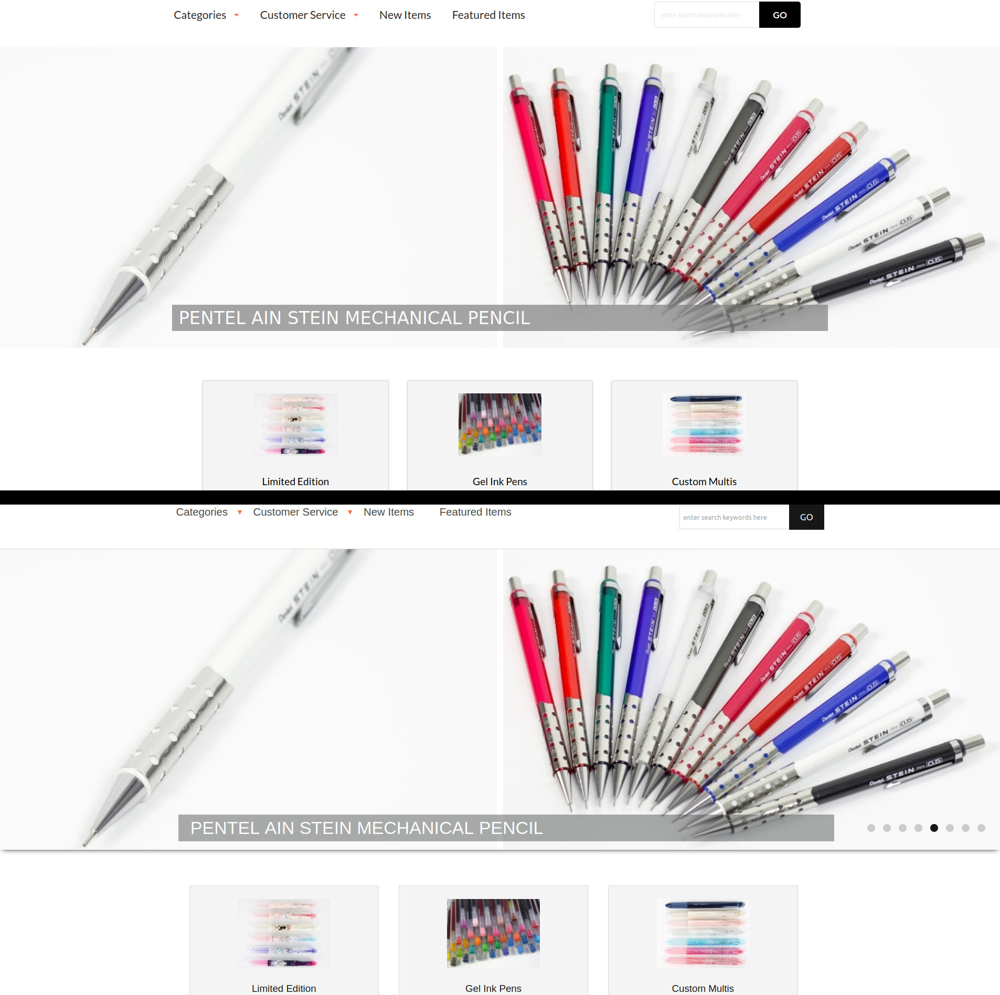

## Refresh your page

I was already familiar with the basics of HTML and CSS as I have worked with it to [create a simple blog](https://rainllo.github.io/projects/mechpencilblog) nearly two years ago. However, I must confess that I have not programmed much in HTML/CSS since then, that is, until now. But unlike the HTML/CSS I had learned previously, the webpages we have been making for the past week utilized Semantic UI. Learning how to use Semantic UI along with vanilla HTML/CSS felt more intuitive compared to using Underscore together with Javascript. The syntax and key words that Semantic UI uses are in plain, natural English which prevented the "what does this function do again?" questions I would sometimes ask myself when working with Underscore. Nonetheless, learning a new concept always comes with new questions and frustations. When I was recreating the [Island Snow website](https://islandsnow.com/) to familiarize myself with Semantic UI the biggest problem I encountered was to conceptualize containers and grids. These two things are used *everywhere* when building a website using Semantic UI so I needed to understand how they worked very well. Thankfully, I quickly realized that the grids and containers used in Semantic UI are no different from the CSS boxes in HTML. It sure is a good thing we spent a week on HTML/CSS!

## Coding my hobby

*NoScript is an addon that blocks Javascript for privacy reasons.*

After recreating the Island Snow website, the next WOD was a pick-your-own project. Naturally, I wanted to do something that was sort of an extension of my mehcanical pencil blog, so I chose to recreate [Tokyo Pen Shop](https://www.tokyopenshop.com/). Other than being one of my favorite sites to buy Japanese stationery, the site itself seems very clean with plenty of menus and most importantly, grids to practice using Semantic UI. Recreating the dropdown menus at the top of the site was a breeze since a similar thing was required to recreate Island Snow. A difficulty I encountered was when I needed to recreate the middle part of the site which consisted of 31 menu boxes arranged in a 3 by 11 grid. Making three centered boxes was not difficult, I simply had to specify as div class of "ui three column grid." The trickier part was trying to get both an image that was horizontally centered with text below that was also centered. After a bit of fiddling I was able to get them in the right positions by placing each in a class "ui segment" and the text was further specified by "ui center aligned segment." After finishing the first row I was able to do a simple copy and paste to create the other 10 rows with different images and texts. My other difficulty, and the most troublesome part of this WOD, was remaking the image banner in the upper part of the site. 
