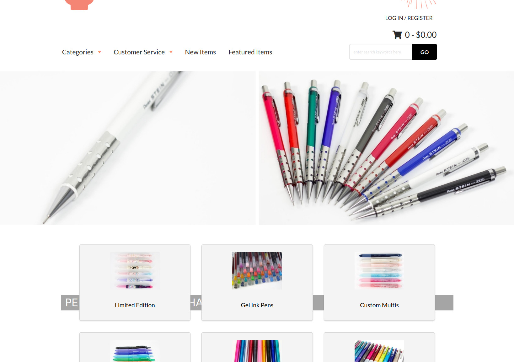

## Refresh your page

I was already familiar with the basics of HTML and CSS as I have worked with it to [create a simple blog](https://rainllo.github.io/projects/mechpencilblog) nearly two years ago. However, I must confess that I have not programmed much in HTML/CSS since then, that is, until now. But unlike the HTML/CSS I had learned previously, the webpages we have been making for the past week utilized Semantic UI. Learning how to use Semantic UI along with vanilla HTML/CSS felt more intuitive compared to using Underscore together with Javascript. The syntax and key words that Semantic UI uses are in plain, natural English which prevented the "what does this function do again?" questions I would sometimes ask myself when working with Underscore. Nonetheless, learning a new concept always comes with new questions and frustations. When I was recreating the [Island Snow website](https://islandsnow.com/) to familiarize myself with Semantic UI the biggest problem I encountered was to conceptualize containers and grids. These two things are used *everywhere* when building a website using Semantic UI so I needed to understand how they worked very well. Thankfully, I quickly realized that the grids and containers used in Semantic UI are no different from the CSS boxes in HTML. It sure is a good thing we spent a week on HTML/CSS!

## Cursed text


*Can you tell which is original and which is the recreation?*

After recreating the Island Snow website, the next WOD was a pick-your-own project. Naturally, I wanted to do something that was sort of an extension of my mehcanical pencil blog, so I chose to recreate [Tokyo Pen Shop](https://www.tokyopenshop.com/). Other than being one of my favorite sites to buy Japanese stationery, the site itself seems very clean with plenty of menus and most importantly, grids to practice using Semantic UI. Recreating the dropdown menus at the top of the site was a breeze since a similar thing was required to recreate Island Snow. A difficulty I encountered was when I needed to recreate the middle part of the site which consisted of 31 menu boxes arranged in a 3 by 11 grid. Making three centered boxes was not difficult, I simply had to specify as div class of "ui three column grid." The trickier part was trying to get both an image that was horizontally centered with text below that was also centered. After a bit of fiddling I was able to get them in the right positions by placing each in a class "ui segment" and the text was further specified by "ui center aligned segment." After finishing the first row I was able to do a simple copy and paste to create the other 10 rows with different images and texts. My other difficulty, and the most troublesome part of this WOD, was remaking the image banner in the upper part of the site. Oddly enough, this should have  been one of the easier parts of the recreation because I did not need to remake the image slideshows since there was no Semantic UI class for it. Unfortunately, I had trouble figuring out how to position the text which was on a transparant background in the bottom middle of the banner image using Semantic UI. In the end I simply defined an img class and a div class within a "pencil-background" class and defined the text properties and position mostly in CSS. It worked but only for regular 1920x1080 sized windows, otherwise it would keep moving around. In hindsight I could have used grids within the banner or just screenshot the picture with the text on top for simplicity's sake. But what can I say, you learn from mistakes. 

*Making the banner with Semantic UI*

```
<div class="pencil-background">
  
  <div class="text banner">PENTEL AIN STEIN MECHANICAL PENCIL</div>
</div> 
```

*Attempting to customize it correctly in style.css*

```
.text.banner {
  position: absolute;
  bottom: -60px;
  left: 50%;
  transform: translate(-50%, -50%);
  width: 1000px;
  padding: 10px 200px 10px 10px;
  font-size: 27px;
  font-family: sans-serif;
  background-color: gray;
  opacity: 0.7;
  color: white;
}
```



*Woops! Now the banner text is hiding*

## The calm before the storm?

Perhaps because HTML/CSS was mostly a review for me and Semantic UI was a fairly straightforward incorporation, this module was pretty easy, knock on wood. The Thursday WOD, which had the longest available time to finish of all the WODs so far, was really easy to do. I mainly have to thank the various attempts at recreating Island Snow and Tokyo Pen Shop, as well as the Tori Richard site for the bWOD for my success in this week's WOD. But I also think some of the ease is due to the more lax requirements for the moment when we're recreating the sites. Notably, there was very little scripts used during this module, I only needed to use the following Javascript to make the dropdown menus funcitonal: 

```
<script>
  $('.ui.dropdown')
      .dropdown()
  ;
</script>
```

Nowadays, virtually all sites use HTML/CSS with Javascript to create visually appealing and interactice user interfaces. It was surprising just how much of a site I was able to build that was still pretty interactive and visually appealing without using any Javascript, and this is all thanks to Semantic UI. Taking a look at the first couple readings of the next module using React it does seem we will now be incorporating more Javascript to build websites. 

