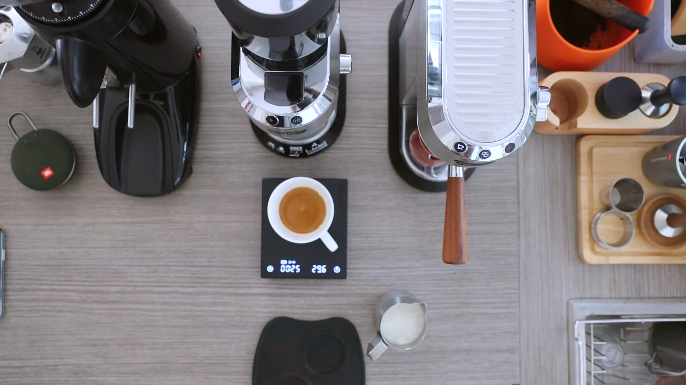

## Crema



I love coffee a lot. And I love computers a lot. I could not imagine my life without having both of them each and every day. I need coffee in the morning — truthfully, throughout the whole day — to wake myself up and stay alert. Meanwhile, I love computers to learn about programming, playing games, watching videos, and just wasting my time online overall. When I purchased my first (cheap) espresso machine over a year ago I did not think it would relate very much to computer science, but after reading up on design patterns I now think there might be some connections after all. As a disclaimer, I am not a hipster coffee snob, okay perhaps a little, but I have yet to spend $500+ dollars on this hobby as other coffee elitists have! Making an espresso shot was a step up from the simpler filter coffee machine I was using previously, there was a lot more effort just to get a decent shot of espresso versus a good cup of coffee. There are two parts to the espresso process: grinding and brewing. And I had much difficulty with both in the beginning. For grinding, I knew I had to grind the beans much finer than I would use for filtered coffee, but I didn’t know exactly how fine I needed it. Too fine and the water will not flow, clogging up the machine. Too coarse and the water will flow through freely and the espresso will be too weak. And when you did get the grind setting just right, you encountered the second problem, brewing. Brew too short and the espresso will taste too strong and not have enough caffeine. Brew too long and it will taste very bitter. Eventually, I made a shot that tasted just right, but at the cost of… 

## The Perfect Cup

… wasted time and coffee beans! This is how design patterns and coffee, as seemingly unrelated as they are, can actually be related. Design patterns are solutions to recurring problems. Programming problems are often repeated with slight variations, but there are general solutions that can be reused to solve them. I think design patterns become more obvious after you have actually finished a program you were working on. After fixing all the bugs, crashes, and other errors over who knows how many days, you might think to yourself, “wow, I wish I had done *this* instead” where *this* is the design pattern. With regards to the decent espresso cup I was trying to make, each non-passable cup would have been considered an “error” in the program. Coffee too watery? Error. Too strong? Error. Too bitter? Error. It took nearly a month and going through an entire bag of coffee beans before I could get it right. Eight clicks to the right of the finest possible grind and 25 seconds brewing time, that was the design pattern I needed. To this day I still use this design pattern to make a good shot of espresso.

## Cafés

Our Campus Cravings website project attempts to compile all information regarding restaurants, cafes, and food trucks and their different menu items to be the one stop place for all things food related at UH Manoa. In many ways, it is an online collection of restaurant menus with items and favorites. In the following code, withTracker connects meteor data to React components. 

```
export default withTracker(() => {
  const subscription = Meteor.subscribe(Restaurants.userPublicationName);
  const subscription2 = Meteor.subscribe(MenuItems.userPublicationName);
  const subscription3 = Meteor.subscribe(Favorites.userPublicationName);
  return {
    menuItem: MenuItems.collection.find({}).fetch(),
    restaurants: Restaurants.collection.find({}).fetch(),
    ready: subscription.ready() && subscription2.ready() && subscription3.ready(),
  };
})(ListRestaurants);
```
Restaurants, MenuItems, and Favorites follow a similar design pattern where we subscribe to them to access the documents. 
