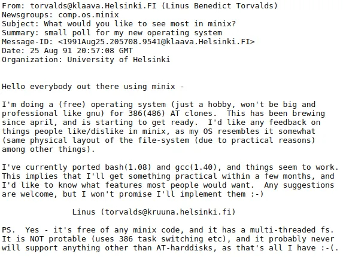

## Keep things private

My interests in software engineering originated in my desire to protect my online privacy. I’m not paranoid nor a conspiracy theorist in a way that the media sometimes depicts people advocating stronger privacy online. No, I just believe that what I choose to keep to myself stays to myself without any person, company, or government attempting to violate that right. I also think the reasons many companies choose to peer into my private life is really nefarious. Today the most valuable thing in the world is data, it’s more valuable than oil and perhaps it’s even more valuable than gold. The more data a company knows about someone, the more they tailor ads specifically for that person to make then purchase more items. Sometimes people post anecdotes about their experiences with this. Take the ‘mattress Google search’ as an example. After searching for a new mattress, a user might suddenly find themselves hit with a 30 seconds long unskippable ad before watching a YouTube video. Does that not seem invasive?

## Libre, or free as in freedom 

Due to these concerns I always block ads and have found myself moving away from proprietary software. I’ve switched my browser from the vastly popular but closed source Google Chrome to the open source Mozilla Firefox. I try to type my documents in LibreOffice rather than Microsoft Office. And I’ve been attempting to fully migrate away from Windows 10 and go full GNU/Linux. The aspect of software engineering that I’m most interested in relates to Free and Open Source, or FOSS for short. I’ve tried the various “beginner” distros: Ubuntu, Linux Mint, and elementaryOS, and I also want to try other distros that require more manual input to compile. Of course, I’m not yet comfortable with doing that as I could brick my laptop, and frankly I don’t have money to spend on *another* new one. Still, I want to experience the nitty-gritty of Linux because it’s considerably more personal and you feel like you understand how the software you use works. Twenty-nine years ago Linus Torvalds announced the Linux kernel and considered it a hobby. Today it has become one of the most enduring products of the open source community, and I just find that really inspiring. I want to become proficient enough at programming so that I can contribute to such community projects. And perhaps I could even develop my skills enough that I could start something on Github that becomes heavily forked in the community.

*"just a hobby, won't be big and professional like gnu" -29 years ago*

## Games and simulations

Other than contributing to open source I also want to create software that can feel real and be enjoyed. I love video games and I have an affinity for simulation games specifically. There’s a game called Cities: Skylines where I sometimes find myself simply watching the city I built for an hour and doing nothing else. Some might say it’s boring, that it doesn’t have the same thrill of first-person shooters or battle royales, but I dispute that. There’s something I just find so fascinating in how a game was programmed to mimic life, there’s even traffic rush hours simulated! I’m interested in learning more about utilizing game engines such as Unity Engine or Unreal Engine. The algorithms needed to make such a game like Cities: Skylines are definitely complicated, they’d have to be to simulate reality. The needed algorithms can sometimes be difficult for me to figure out, or even understand so I will need to develop those skills further.

