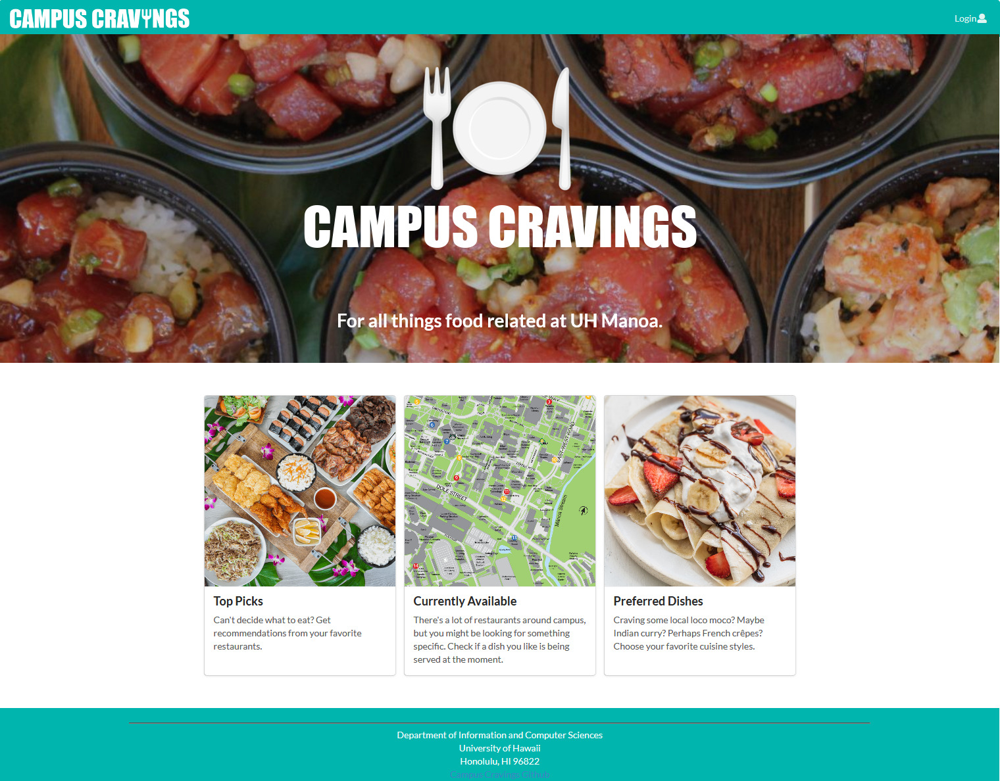
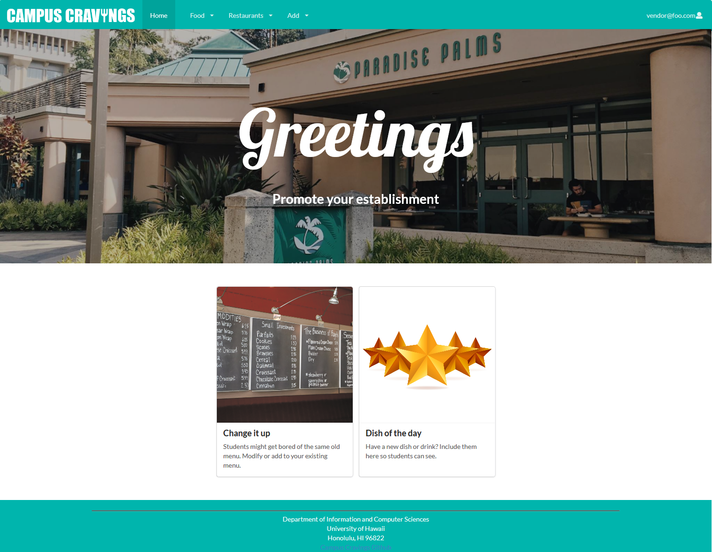

## About 

There are plenty of food vendors at the University of Hawaii at Manoa. Not to mention, the campus itself is quite expansive. For these reasons it might be difficult for a student to decide where to eat during the limited amount of time they have between their classes. To solve this problem my team and I created a website that provides an up-to-date resource on everything food related at UH Manoa. My teammates were Alexander Lum, Riley Sodetani, and Ty Ikenaga. 

### Explore the site

For a direct link to the website itself visit: [campuscravings.xyz](https://campuscravings.xyz/#/)

For in-depth information on the project as well as installation instructions go [here](https://campus-cravings.github.io/).

And for the source code check our repository [here](https://github.com/campus-cravings/campus-cravings).

## Contributing to the project

  
  
  

I contributed mainly to the front-end of the website. This includes the landing page that greets the user when they visit the website for the first time as well as the different profile home-pages after logging in as either *user*, *vendor*, or *admin*. These homepages are customized to the needs of each profile, for example: a vendor will want to edit their restaurant's menu while a user might want to view the different menus. The cards at the bottom of the home pages link to relevant parts of the website for each profile. 

My teammates worked more heavily on the databases and inputs that allow for adding restaurants, dishes, and preferences. Still, I was also able to contribute in this regard by creating an Add Featureds page that allows vendors to promote a dish and a Featureds page where users can view the top picks of the day. 

## Happy with the results

We used all the knowledge and skills we had learned throughout the semester to work on this final project. At the beginning of the semester I was initially worried that I would have difficulty in doing the final project. But over time I had learned many important software engineering concepts and technologies to help build a very aesthetic and functional website. This website is a culmination of all that I have learned in Software Engineering. Nonetheless, even more important than knowing how to create the website is knowing how to work well with a team. I am very grateful to have worked with the people on my team as they have helped me very much just as I have tried to help them too. Overall, this project has demonstrated my improved understanding of programming as well as a better ability to work with a team.