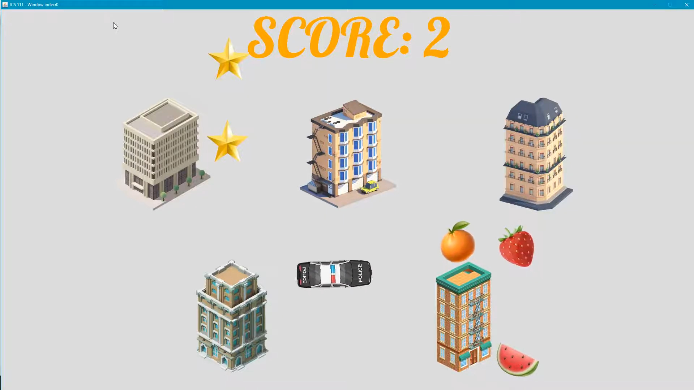

  
  
  

Fruity Chase was my submission for the second project of ICS 211. Both Project 1 and Project 2 were similar. The player had to collect the items (in my game it's the fruits) with a player controlled character (the police car) while avoiding obstacles (the buildings). The main difference was the introduction of Java classes as part of our assessment on mastery of object oriented programming. Using classes I was able add complexity to the game. The fruits now moved randomly within the game window as initially they were fixed in place. This made it harder to win the game as the police car needed to move more nimbly around the buildings. It also made programming the game harder as I initially had difficulty understanding how to use classes in Java. I also needed to change my program so the fruits would drop an item where they were collected. In my first project this was simple, since the fruit stayed at a fixed located, say (200, 200), if I picked up the fruit I could just add an image of a star at the same location. But with the fruits moving I needed to take into account the constant changing x and y positions. 

This games uses the [EZ graphics library](http://www2.hawaii.edu/~dylank/ics111/) which helped in learning how to build Java applications. The player controls a polic car with the WASD keys and must collect the fruits that move randomly in the game. The fruits then drop a star at the location where they were picked and plays a sound. The player needs to be careful, however, as there are buildings placed in set locations that act as obstacles. If the one is not careful and collides with the building an explosion happens and the player loses. Once all five fruits have been successfully collected the player wins and a celebratory song is played at the end. 
