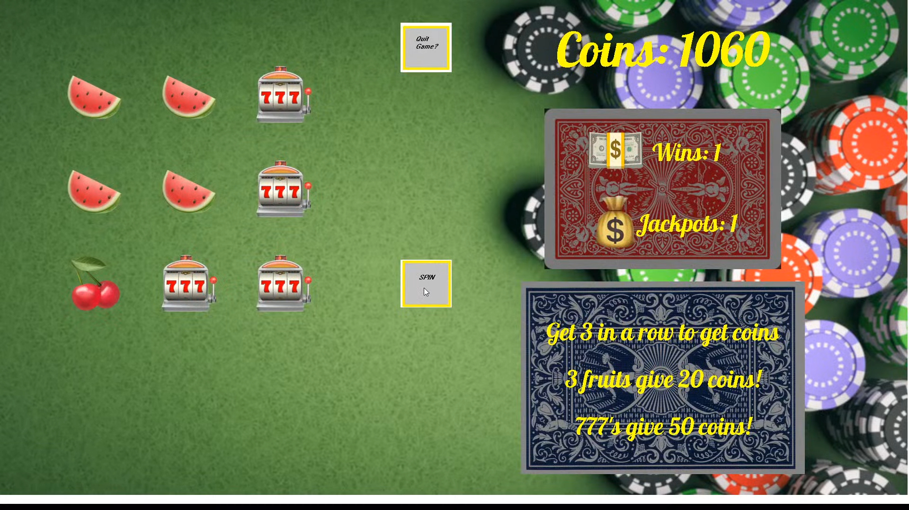

Fruity Slots was a group project for ICS 111. To create the game I teamed up with Micah Kwon and Eric Kuang. While there were many ideas for what we should make for our final project we eventually settled on doing a slot machine. After all, people in Hawaii love visiting the ninth island, Las Vegas, to gamble! And wanting to continue the habit of using fruits in my previous projects I suggested we make a fruit themed slot machine. 

We divided the work so that each of us could make a separate aspect of the slot machine which we would combine later in the the main() class. Micah was tasked with making the *SPIN* and *Quit Game* buttons, Eric would make the score counter that gives a certain score depending on the three-in-a-row the player got, and I would be making the reel spinning mechanism itself. 

For my class I needed to find a way to identify if there was a three-in-a-row, both horizontally and vertically, of the same fruit on the grid. So I made a 2D array that was 3x3 in size and each cell would be given a value:

```
picGrid[0][0] = al.get(0);
picGrid[1][0] = al.get(1);
picGrid[2][0] = al.get(2);
picGrid[0][1] = al.get(3);
picGrid[1][1] = al.get(4);
picGrid[2][1] = al.get(5);
picGrid[0][2] = al.get(6);
picGrid[1][2] = al.get(7);
picGrid[2][2] = al.get(8);
```

Then I needed to make switch statements for all nine grid boxes with 7 different cases representing a fruit: 

```
switch (picGrid[0][0]) { 
  case 0:
    EZ.addImage("icon1.png", 200, 200);
	  break;
	case 1:
		EZ.addImage("icon2.png", 200, 200);
		break;
  ...
	default:
			System.out.println("error0,0");
	}
```

While the switch statement placed the fruits onto the screen, it still didn't determine whether or not a three-in-a-row of the same fruit was made. For that I needed an if else block for all the variations I of a three-in-a-row, including horizontal and vertical, that could be possible in the 3x3 grid. 
