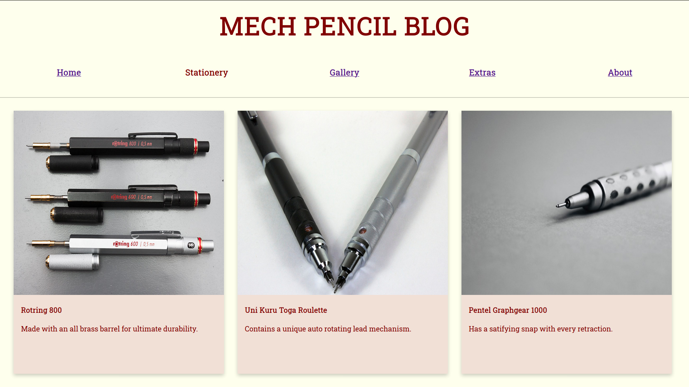
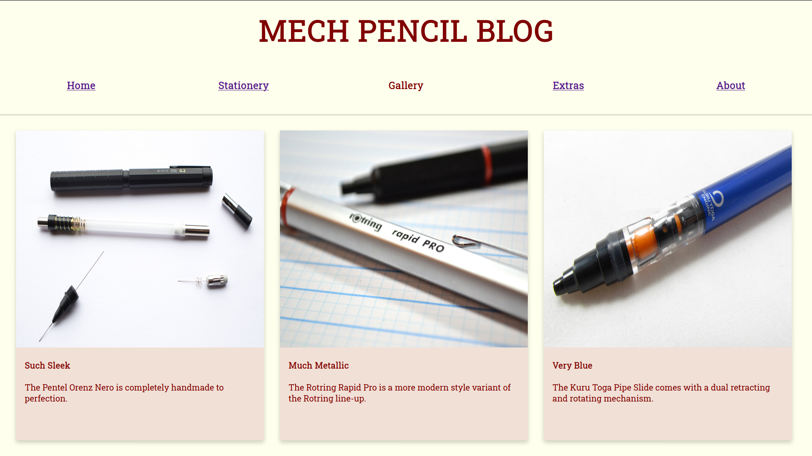

I love high quality stationery and collecting overengineered mechanical pencils is a hobby of mine. In May 2018 I was learning a lot about how to build web pages using HTML and CSS. With HTML I learned how to create the backbone of a web page: 
, the six different levels of headings, hyperlinking, adding images, and many others. Still, building a web page with HTML alone would not suffice as it was to simply put, ugly to look at. I needed to use CSS to actually make the page look visually appealing. At first I thought I would make it look like those traditional forum layouts we've all probably seen before. But, I didn't need long paragraphs to describe how great mechanical pencils were, I just had to show an appealing picture because as they say, *a picture is worth a thousand words.* By attempting to follow [Google's Material Design guidelines](https://material.io/design) I believe I was able to put emphasis on the beauty of mechanical pencils. 

Material Design is a way of creating user interfaces that utilizes card-like motifs. By using a layer of paper metaphor, Material Design blends both flat and three-dimensional interfaces. The subtle shadows behind the "cards" lets the viewer feel as if the content is on top and in focus. My inspiration for choosing to follow this design guideline was thanks to my frequent exposure of Google products. My very first smartphone was an Android phone, I've never felt like I wanted to use iPhones and iOS. When Google introduced Material Design in 2015 they updated many of their services, such as Gmail, to use this design language and I just loved the way it looked. 

My Mech Pencil Blog website consists of six different HTML pages that link to different parts. Users start at the "Home" webpage and are encouraged to click around the links at the top that redirect them to the relevant topics. There is no Javascript used, so the pages are static but are designed to look visually appealing. 
